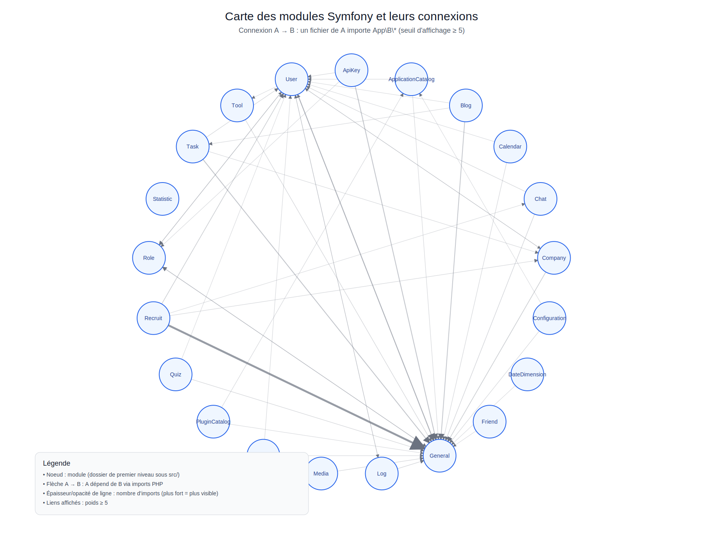

# Carte des modules et de leurs connexions

Voici une visualisation des modules métier (`src/*`) et de leurs dépendances internes :



## Méthode de génération

- Un module correspond à un dossier de premier niveau sous `src/` (ex: `User`, `Recruit`, `Task`, ...).
- Une connexion `A → B` est détectée quand une classe PHP du module `A` déclare `use App\\B\\...`.
- Pour garder le schéma lisible, seules les connexions avec un poids **>= 5** imports sont affichées.

## Regénérer l'image

```bash
python tools/generate_module_connections_svg.py
```
